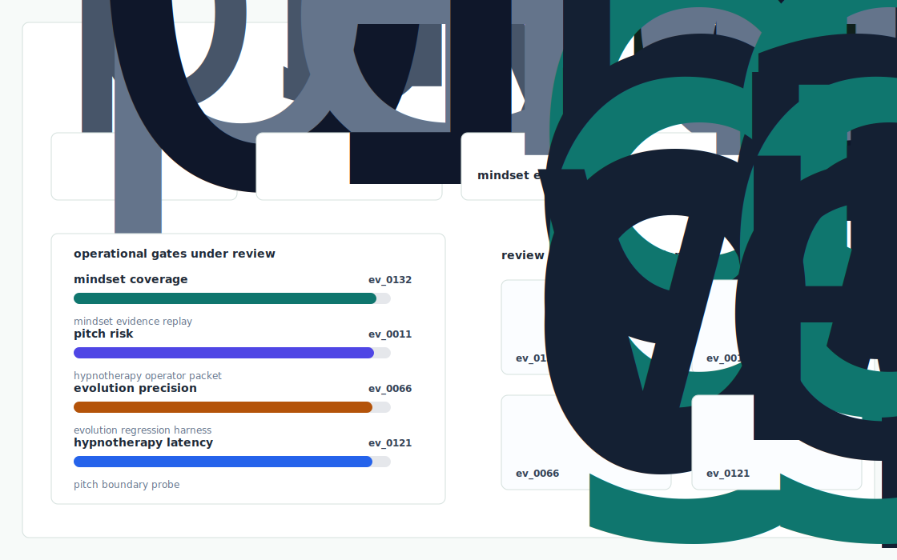

# Psyche Bench

The clinical ML evaluation harness Mindset needs before any "foundation model of psychophysiology" can ship safely across Nerva, Evia, Claria, Relio and Finito — a versioned offline eval framework plus a per session telemetry schema that produces IBS SSS equivalent outcome predictions from the first 7 days of app behavior.



## Why it exists

Mindset's pitch evolution — "hypnotherapy apps" -> "foundation model of psychophysiology" — has out run its public engineering. The clinically published Nerva RCT (PMC11179457) reports adherence and persistence as the primary moderator of outcome, not session content. Yet a user opening Nerva today gets the same 42 day program regardless of whether they.

The project is intentionally built as a local replay harness instead of a slide. It creates fixtures, plants realistic failure modes, produces citation-locked evidence, and turns the result into a dashboard a reviewer can inspect without credentials or hosted services.

## What is inside

- Deterministic fixture generation for the company-specific risk surface.
- Strategy code in `src/psyche_bench/strategy.py` with project-specific scoring and visual evidence.
- Citation-locked reports where every decision claim points to a generated evidence ID.
- Two regenerated visual artifacts: `outputs/project_working.svg` and `outputs/evidence_map.svg`.
- A portable demo pack with JSON, CSV, Markdown, HTML, SVG, benchmark, and test artifacts.


## Signals it measures

- `mindset coverage`
- `pitch risk`
- `evolution precision`
- `hypnotherapy latency`

## Failure modes it plants

- mindset drift
- pitch gap
- evolution misroute
- hypnotherapy blindspot

## Run it locally

```bash
uv sync
uv run psyche-bench all
uv run pytest -q
uv run ruff check .
```

## Outputs worth opening

- `outputs/dashboard.html`
- `outputs/project_working.svg`
- `outputs/evidence_map.svg`
- `outputs/operator_brief.md`
- `outputs/decision_report.md`
- `outputs/strategy_model.json`
- `outputs/demo_pack.zip`

## Sources

- https://mindsethealthlabs.com/
- https://pmc.ncbi.nlm.nih.gov/articles/PMC11179457/
- https://www.monash.edu/medicine/news/latest/2024-articles/hypnotherapy-reduces-irritable-bowel-syndrome-symptoms-and-now-theres-an-app-for-that
- https://onlinelibrary.wiley.com/doi/10.1111/nmo.14533
- https://www.mindsethealth.com/mindset-health-series-a-afr
- https://balancethegrind.co/interviews/alex-naoumidis-co-founder-co-ceo-at-mindset-health/
- https://www.prnewswire.com/news-releases/mindset-health-raises-us12m-to-expand-digital-hypnotherapy-apps--scale-distribution-301776991.html
- https://www.ycombinator.com/companies/mindset-health

## Boundary

Everything runs locally against synthetic fixtures. There are no credentials, no customer records, no outreach files, and no hosted API dependency.
